# MindVibe — Visual Framework & IP Filing Map

**Everything as flowcharts: architecture, engines, request lifecycle, and the exact offices where each MindVibe IP asset can be filed.**

> Renders best on GitHub (Mermaid native). All diagrams have ASCII fallbacks where useful.

## Contents

1. [System Architecture (End-to-End)](#1-system-architecture-end-to-end)
2. [Request Lifecycle](#2-request-lifecycle)
3. [Per-Engine Flowcharts](#3-per-engine-flowcharts)
4. [IP Type Decision Tree](#4-ip-type-decision-tree--what-protection-fits-which-asset)
5. [Where to Apply for IP Rights (Offices & Routes)](#5-where-to-apply-for-ip-rights)
6. [Patent Filing Flowchart](#6-patent-filing-flowchart)
7. [Trademark Filing Flowchart](#7-trademark-filing-flowchart)
8. [Copyright Registration Flowchart](#8-copyright-registration-flowchart)
9. [Trade Secret Protection Flowchart](#9-trade-secret-protection-flowchart)
10. [Database Right Flowchart](#10-database-right-flowchart)
11. [Defensive Publication Flowchart](#11-defensive-publication-flowchart)
12. [Pre-Merge IP Gating](#12-pre-merge-ip-gating)
13. [Master IP Map: Asset → Office Quick Reference](#13-master-ip-map-asset--office-quick-reference)

---

## 1. System Architecture (End-to-End)

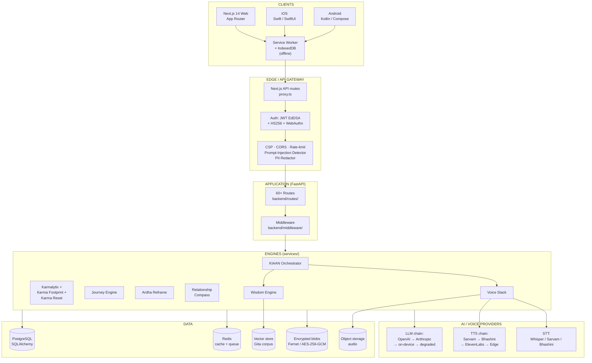

---

## 2. Request Lifecycle

A user message → the response. Every box is a real file or directory.

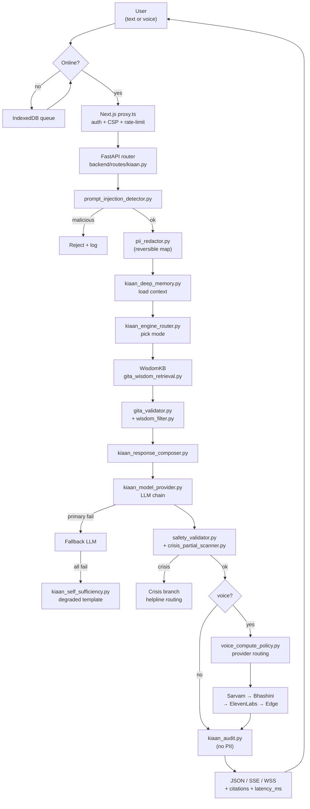

---

## 3. Per-Engine Flowcharts

### 3.1 KIAAN — Conversational Wisdom Companion

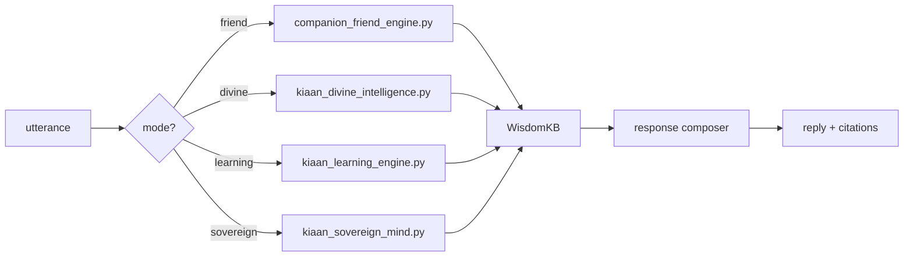

### 3.2 Wisdom Engine

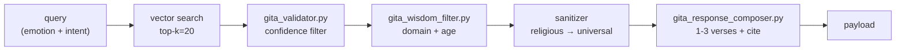

### 3.3 Karmalytix

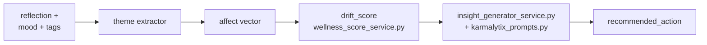

### 3.4 Karma Footprint Engine (isolated from KIAAN)

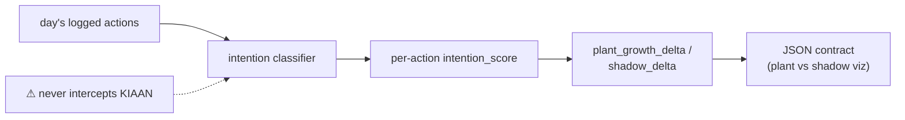

### 3.5 Karma Reset / Emotional Reset

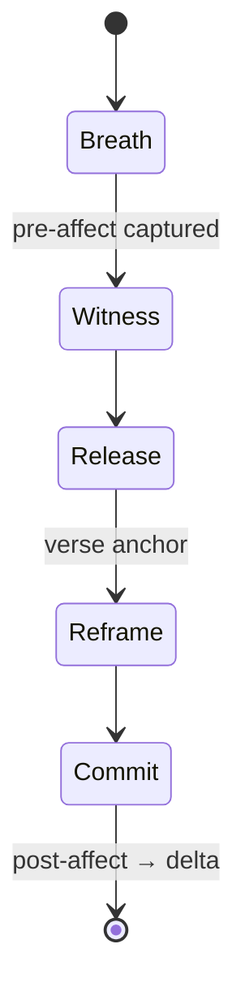

### 3.6 Journey Engine

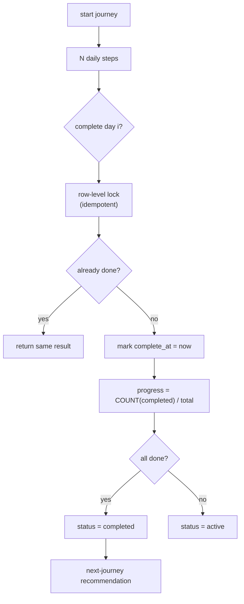

> **Critical invariant (ADR-001):** progress derives from *completed-step count*, never from `current_day_index`. Preserve under all changes.

### 3.7 Ardha Reframing

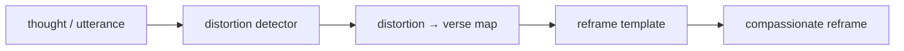

### 3.8 Relationship Compass

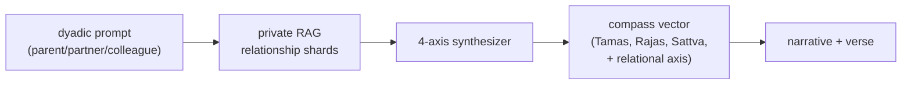

### 3.9 Voice Stack

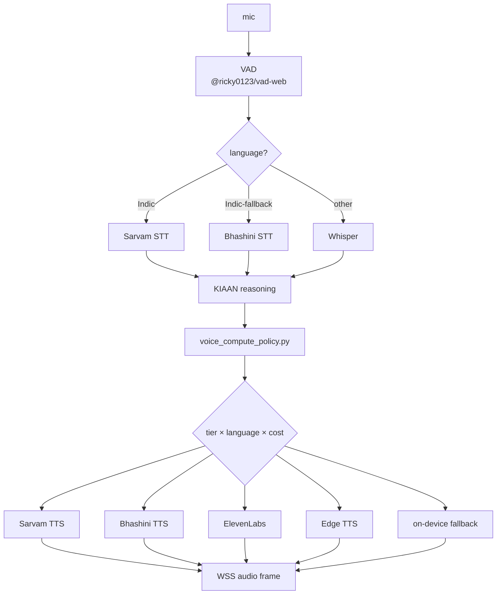

---

## 4. IP Type Decision Tree — what protection fits which asset

For every invention, idea, mark, or asset, run this tree.

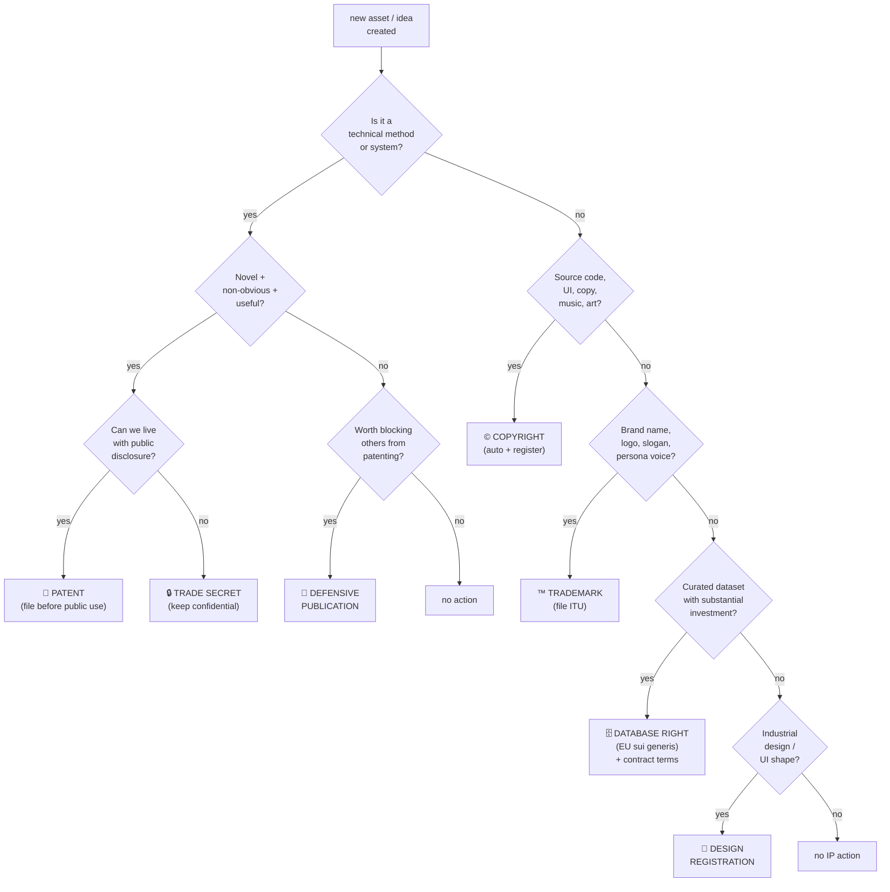

**Rule of thumb for MindVibe:**

| Asset class | Default protection |
|---|---|
| Engine algorithms (P-1…P-12) | Patent **or** trade secret (decide per-invention via tree above) |
| System prompts, ranker weights | Trade secret |
| Source code, docs, designs | Copyright (auto) + register |
| Brand names, logos, persona voice | Trademark + voice/sound mark |
| Curated Gita corpus + tag layer | Database right (EU) + contract + copyright on editorial layer |
| UI/UX visual + motion design | Copyright + design registration in key markets |

---

## 5. Where to Apply for IP Rights

> **You do NOT need to file in every country.** File in (a) your home market, (b) where your customers are, (c) where competitors operate, (d) where infringement is likely. For most software companies that's: **US, EU, UK, India, Japan, China, plus PCT/Madrid for "everywhere else."**

### 5.1 Major IP offices (one-stop reference)

| Office | Country / Region | What you file there |
|---|---|---|
| **USPTO** — uspto.gov | United States | Utility patents, design patents, trademarks |
| **U.S. Copyright Office** — copyright.gov | United States | Copyright registration (statutory damages) |
| **EPO** — epo.org | Europe (38 states) | European patent (validate per country after grant) |
| **EUIPO** — euipo.europa.eu | EU 27 | EU trademark (single filing covers all 27) + Registered Community Design |
| **UKIPO** — gov.uk/ipo | United Kingdom | UK patents, trademarks, designs (post-Brexit, separate from EU) |
| **IP India** — ipindia.gov.in | India | Patents, trademarks, designs, copyrights |
| **JPO** — jpo.go.jp | Japan | Patents, trademarks, designs |
| **CNIPA** — cnipa.gov.cn | China | Patents, trademarks, designs (first-to-file — file early) |
| **KIPO** — kipo.go.kr | South Korea | Patents, trademarks, designs |
| **CIPO** — cipo.ic.gc.ca | Canada | Patents, trademarks, designs, copyrights |
| **IP Australia** — ipaustralia.gov.au | Australia | Patents, trademarks, designs |
| **WIPO** — wipo.int | International | **PCT** (international patent), **Madrid** (international trademark), **Hague** (international design), DAS, ePCT |

### 5.2 IP type → office mapping (file order)

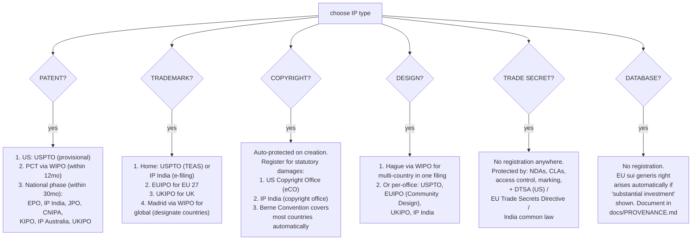

### 5.3 Jurisdiction × IP type — MindVibe priority matrix

| Jurisdiction | Patents | Trademarks | Copyright reg. | Designs | Why |
|---|---|---|---|---|---|
| **US** | ★★★ | ★★★ | ★★★ | ★★ | Largest market, statutory damages require US Copyright reg. |
| **India** | ★★★ | ★★★ | ★★ | ★★ | Home market, Sanskrit/Indic content, Bhashini partner ecosystem |
| **EU (EUIPO + EPO)** | ★★ | ★★★ | ★ (Berne) | ★★ | Single-filing efficiency; sui generis DB right is EU-only |
| **UK (UKIPO)** | ★★ | ★★★ | ★ (auto) | ★★ | Post-Brexit separate filings; English-language market |
| **Japan** | ★★ | ★★ | ★ (Berne) | ★ | Wellness/spirituality market, premium tier |
| **China (CNIPA)** | ★★ | ★★★ | — | ★ | **First-to-file** — file TM defensively before launch |
| **Canada / Australia** | ★ | ★★ | ★ | ★ | Madrid + PCT designations |
| **Rest of world** | via PCT | via Madrid | Berne auto | via Hague | Designate strategically |

★★★ = file day-one · ★★ = file at launch · ★ = file when revenue justifies

### 5.4 The "international" routes (one filing → many countries)

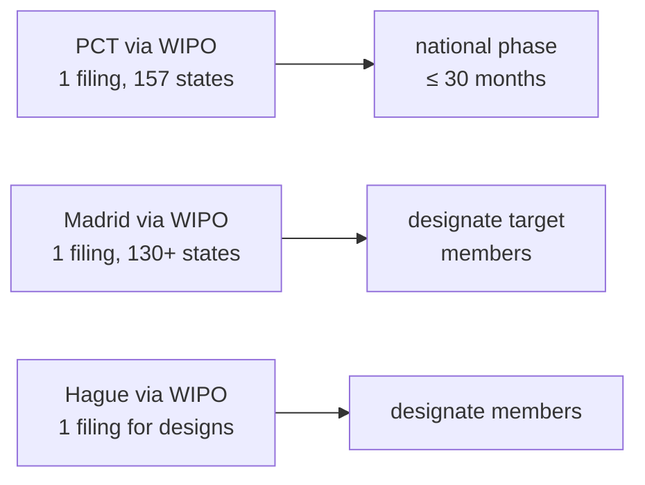

PCT and Madrid are **the** filings to learn. They postpone the cost-explosion of multi-country filings while preserving priority dates.

---

## 6. Patent Filing Flowchart

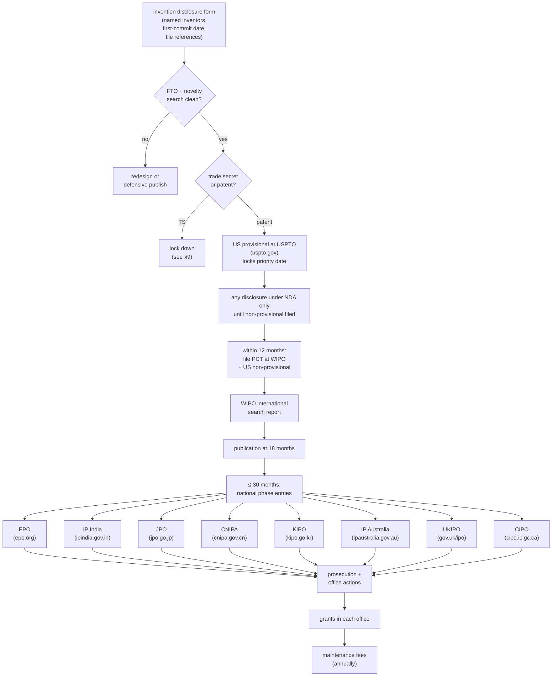

**MindVibe candidate inventions to take through this flow** (from `docs/FRAMEWORK.md` §4.1): P-1 through P-12. Top priorities for the first US provisionals: **P-1** (sanitization pipeline), **P-2** (RAG ranker), **P-4** (voice routing policy), **P-5** (Karma Footprint classifier), **P-7** (idempotent journey progress), **P-12** (streaming crisis classifier).

---

## 7. Trademark Filing Flowchart

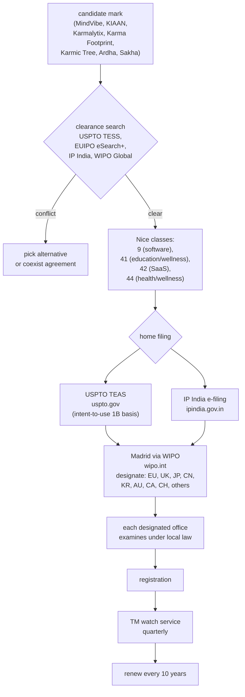

**MindVibe TM priority list:**

1. **MindVibe** (word + logo) — classes 9, 41, 42, 44
2. **KIAAN** + **KIAANverse** (word + logo + sound mark for the persona voice) — classes 9, 41, 42
3. **Karmalytix** — classes 9, 42
4. **Karma Footprint** + **Karmic Tree** (figurative for plant/shadow viz) — classes 9, 42
5. **Karma Reset** + **Emotional Reset** — classes 9, 41, 44
6. **Ardha** (in product context) — classes 9, 42
7. **Sakha** — verify prior use first; classes 9, 41

Sound marks (KIAAN voice signature) are filed separately as **non-conventional trademarks** (USPTO accepts; EUIPO accepts; CNIPA limited).

---

## 8. Copyright Registration Flowchart

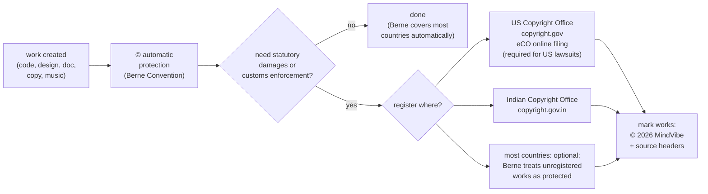

**What MindVibe should register:**

| Work | Where | Why |
|---|---|---|
| Backend source code (snapshots) | USCO + IP India | Statutory damages for code theft |
| Frontend source code (snapshots) | USCO + IP India | Same |
| Brand assets (logos, motion spec, storyboards) | USCO + IP India | Visual infringement |
| Documentation (FRAMEWORK.md, marketing copy) | USCO | Editorial + selling-document infringement |
| Original translations (per language) | IP India | Translator-assignment chain proof |
| Sakha persona scripts | USCO | Voice/character protection (alongside TM) |

> Code is registered as a **snapshot** (deposit a redacted copy — trade-secret portions can be blocked out per USCO rules). Re-register on major versions.

---

## 9. Trade Secret Protection Flowchart

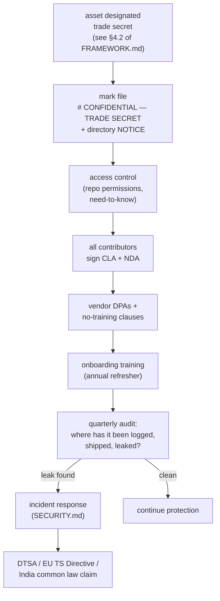

**No filing office for trade secrets.** Protection is purely operational. Statutes that *enforce* trade-secret rights:

| Jurisdiction | Statute |
|---|---|
| United States | Defend Trade Secrets Act (DTSA, 18 USC §1836) + state UTSA |
| EU | Trade Secrets Directive 2016/943 + national implementations |
| United Kingdom | Common law breach of confidence + post-2018 Trade Secrets Regs |
| India | Common law (no codified statute as of 2026) — rely on contract |
| Japan | Unfair Competition Prevention Act |
| China | Anti-Unfair Competition Law (revised) |

The marking + NOTICE + access control work in this branch's commit `60d134b` is **the** prerequisite for any of these claims to succeed.

---

## 10. Database Right Flowchart

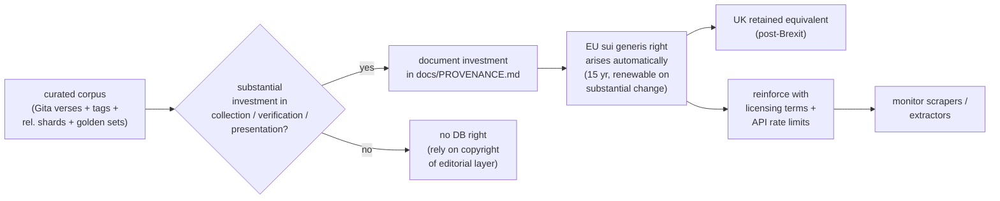

**No registration office.** EU sui generis is automatic. Outside EU/UK, rely on copyright of the editorial / tagging layer + licensing terms in `TERMS.md`.

---

## 11. Defensive Publication Flowchart

When you have an invention you've decided **not** to patent, but you want to block competitors from patenting it against you:

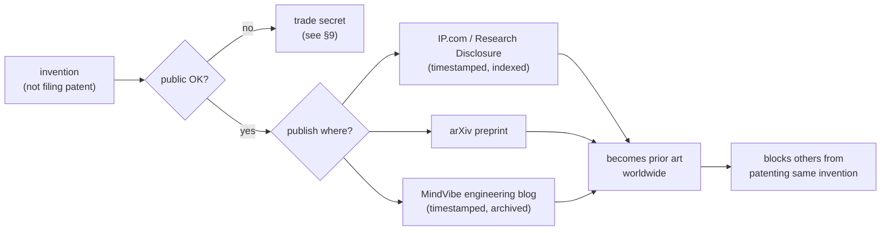

Defensive publication is **cheap insurance** for inventions you don't want to keep secret but don't want to patent. Especially good for narrow improvements around your core patents.

---

## 12. Pre-Merge IP Gating

Run this on every PR. Embed as CI check.

```mermaid
flowchart TD
  PR["PR opened"] --> Q1{"changes files in<br/>backend/services/CONFIDENTIAL.md<br/>list?"}
  Q1 -- yes --> CLA{"author signed CLA?"}
  CLA -- no --> Block1["block: require CLA"]
  CLA -- yes --> Q2
  Q1 -- no --> Q2{"adds new corpus,<br/>dataset, font, image,<br/>translation, vendor?"}
  Q2 -- yes --> Prov{"docs/PROVENANCE.md<br/>updated?"}
  Prov -- no --> Block2["block: add provenance row"]
  Prov -- yes --> Q3
  Q2 -- no --> Q3{"adds an algorithm<br/>resembling P-1…P-12?"}
  Q3 -- yes --> Disc["require invention<br/>disclosure form<br/>before merge"]
  Disc --> Q4
  Q3 -- no --> Q4{"adds a new<br/>brand mark or<br/>persona name?"}
  Q4 -- yes --> TM["TM clearance check<br/>before public use"]
  TM --> Q5
  Q4 -- no --> Q5{"removes a<br/>CONFIDENTIAL marker?"}
  Q5 -- yes --> Block3["block: requires<br/>IP-owner approval"]
  Q5 -- no --> Pass["✅ IP gate passed"]
```

---

## 13. Master IP Map: Asset → Office Quick Reference

This is the **one table** to print and pin.

| MindVibe asset | IP type | File at |
|---|---|---|
| **P-1** Religious-to-universal sanitization pipeline | Patent | USPTO → PCT → EPO, IP India, JPO, CNIPA |
| **P-2** Emotion+intent RAG ranker | Patent | Same as P-1 |
| **P-3** Mode-routing companion | Patent | Same |
| **P-4** Cost/privacy-aware voice routing | Patent | Same |
| **P-5** Karma Footprint dual-axis classifier | Patent | Same |
| **P-6** Emotional reset state machine | Patent | Same |
| **P-7** Idempotent journey progress | Patent | Same |
| **P-8** Drift score | Patent | Same |
| **P-9** 4-axis dyadic compass | Patent | Same |
| **P-10** Injection + reversible-PII co-pipeline | Patent | Same |
| **P-11** Sovereign degraded mode | Patent | Same |
| **P-12** Streaming crisis classifier | Patent | Same |
| System prompts (`prompts/`) | Trade secret | (no filing — operational protection) |
| Ranker weights, thresholds | Trade secret | (no filing) |
| Routing tables (cost × latency × language) | Trade secret | (no filing) |
| Source code (full repo snapshot) | Copyright | USCO (copyright.gov), IP India |
| Documentation, FRAMEWORK.md, marketing | Copyright | USCO |
| Sakha persona scripts | Copyright + TM (sound) | USCO + USPTO + EUIPO |
| Original translations (17 langs) | Copyright | IP India + USCO (work-for-hire chain) |
| **MindVibe** (word + logo) | Trademark | USPTO + IP India + EUIPO + UKIPO + Madrid (WIPO) |
| **KIAAN** / **KIAANverse** | Trademark + sound mark | Same |
| **Karmalytix** | Trademark | Same |
| **Karma Footprint** / **Karmic Tree** | Trademark + figurative | Same |
| **Karma Reset** / **Emotional Reset** | Trademark | Same |
| **Ardha** (product context) | Trademark | Same |
| Logo, icon set | Copyright + design | USCO + Hague (WIPO) |
| UI/UX screen designs | Design registration | EUIPO Community Design + USPTO design patent + Hague |
| Motion spec, storyboards | Copyright | USCO |
| Curated Gita corpus + tag layer | Database right (EU) + copyright (editorial) | EU automatic + USCO for editorial layer |
| Relationship-wisdom shards | Database right + copyright | Same |
| Golden eval datasets | Trade secret + copyright | (no filing for TS) + USCO |
| Brand fonts (if original) | Copyright | USCO |
| Background music / breath cues | Copyright | USCO |

---

## Action checklist for the next 90 days

- [ ] Run §4 decision tree on each of P-1…P-12; mark patent vs trade secret in the inventor register
- [ ] File US provisionals at **uspto.gov** for the top 3 patent picks (P-1, P-5, P-7 recommended) — locks priority for 12 months at low cost
- [ ] File trademarks (intent-to-use, 1B basis) at **uspto.gov** + **ipindia.gov.in** for MindVibe, KIAAN, Karmalytix, Karma Footprint
- [ ] Set up Madrid international application via **wipo.int** designating EU, UK, JP, CN, KR, AU, CA
- [ ] Register a code-snapshot at **copyright.gov** for the current `main` branch
- [ ] Confirm "no-training" addenda with OpenAI, Anthropic, ElevenLabs (close TBDs in `docs/PROVENANCE.md` §5)
- [ ] Add CI check implementing §12 pre-merge IP gate
- [ ] Defensive-publish two narrow improvements you decided not to patent, on IP.com or arXiv
- [ ] Schedule annual IP review (Q1 each year) with counsel

---

> **Disclaimer.** This document maps engineering reality to IP filing options. It is not legal advice. Every filing decision should be confirmed with a registered patent attorney / trademark agent in the relevant jurisdiction. URLs reference official IP offices as of writing — verify before filing.

🙏
