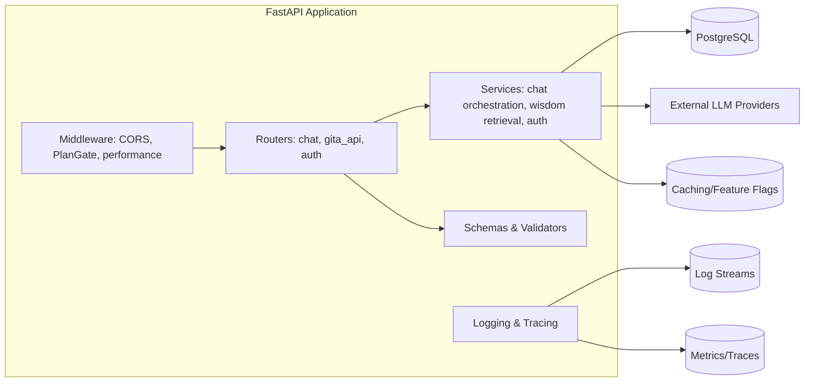
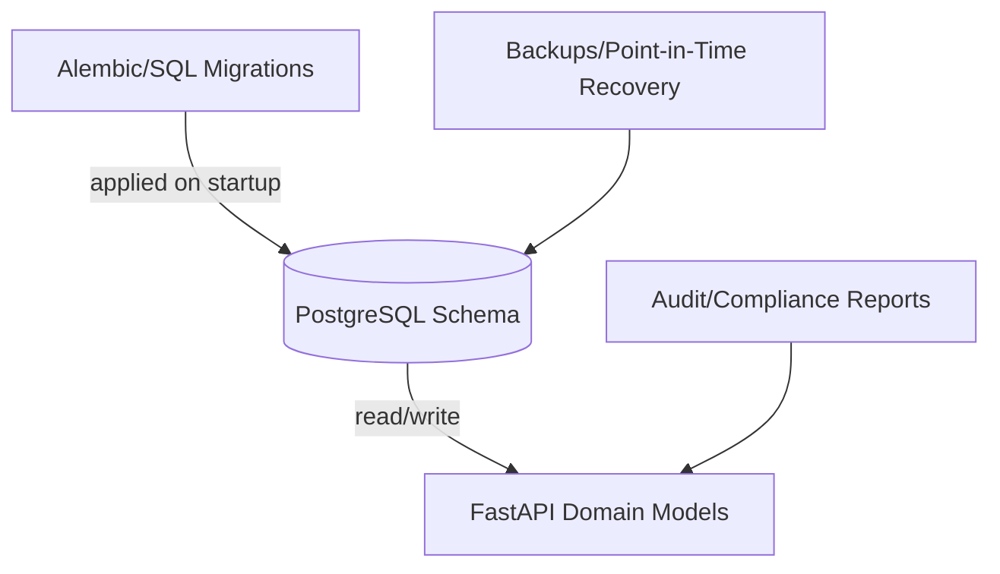

# System Diagrams

These diagrams illustrate how MindVibe routes user traffic, orchestrates backend components, and persists data. Use them alongside `IMPLEMENTATION_COMPLETE.md` and `pipeline_design_rationale.md` when onboarding new contributors or validating deployment plans.

## High-Level Request Flow

```mermaid
graph TD
    User[User (Web/Mobile)] -->|HTTPS| WebApp[Next.js Frontend]
    WebApp -->|REST/JSON over HTTPS| API[FastAPI Backend]
    API -->|Auth & Plan Gates| Middleware[Middleware Layer]
    API -->|Business Logic| Services[Domain Services]
    Services -->|Async Jobs| Jobs[Background Workers]
    Services -->|SQL Queries| DB[(PostgreSQL)]
    Services -->|LLM Prompts| OpenAI[(OpenAI API)]
    Jobs -->|Telemetry| Obs[Observability Stack]
    API -->|Metrics & Traces| Obs
```

**Notes**
- The Next.js frontend communicates with the FastAPI backend via authenticated REST calls.
- Middleware handles CORS, feature gating, and performance tracking before requests reach domain services.
- Domain services manage chat orchestration, wisdom retrieval, and persistence in PostgreSQL; long-running work is offloaded to background jobs.
- Observability captures metrics/traces from both synchronous requests and asynchronous job runners.

## Backend Component Relationships



**Notes**
- Routers define public endpoints and delegate to service modules using validated schemas.
- Middleware enforces cross-cutting policies (CORS, feature gating, performance collection) before routing.
- Services interact with PostgreSQL and external LLM providers; optional caches/feature-flag stores can be layered in without changing router contracts.

## Data Persistence and Migration Path



**Notes**
- SQL migrations run during application startup when `RUN_MIGRATIONS_ON_STARTUP` is enabled, ensuring schema parity across environments.
- Backups and PITR configurations protect the PostgreSQL instance; auditing hooks export data needed for compliance reporting.
